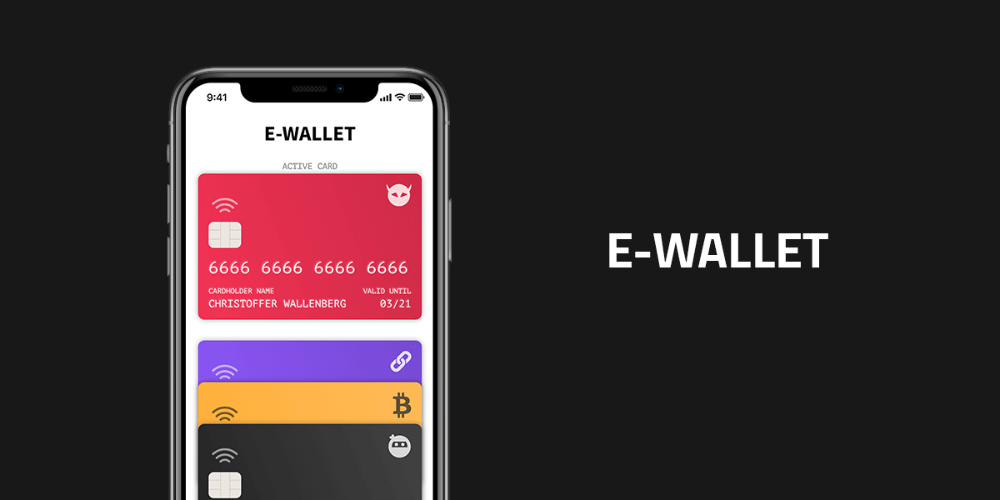

# E-wallet
Du ska bygga en digital plånbok som samlar alla kreditkort. Det ska gå och se sina kreditkort samt lägga till nya.

## Tekniska krav
Tekniker du ska använda i denna app är följande:

* Local properties (data)
* Inherited properties ( props )
* Computed properties
* Events ( Browser och Custom )
* Methods
* v-for ( incl. key and props in a loop )
* LocalStorge ( VG )
* Life Cycle Hook ( VG )

## Funktionella krav

### Home
* Kortet högst upp är *active card*.

* Vid klick på kort i listan så ska den läggas som *active card* högst upp i vyn.

* Vid klick på **Add new card** ska man visa AddCard-view.

* AddCard-viewn ska 

* Varje nytt card som läggs till ska synas i en lista i denna vy.


### AddCard
* Ett nytt kort ska kunna läggas till med följande information: 
```
{
  vendor, 
  cardNumber, 
  cardholder, 
  expireMonth, 
  expireYear, 
  CCV
}
```


## Design

### Figma Mockup
Här har du en [Figma-fil med Mockup](./mockup.fig) över färdiga appen.


### Demo


### Assets
#### Typografi
Rubriker: [Source Sans Pro](https://fonts.google.com/specimen/Source+Sans+Pro?query=source+sans)

Brödtext: [PT Mono](https://fonts.google.com/specimen/PT+Mono?query=PT+Mono)

#### Ikoner


## Bedömning

**För att få Godkänt ska du:**
* Ha gjort uppgiften med ```vue create```
* Gjort enligt spec och Figma skissen (det behöver inte vara exakt enligt design)
* Det är en single file application (SPA).

**För att Väl Godkänt ska du:**
* Spara korten och alla nya kort som läggs till i local storage samt läsa från local storage
* Det ska gå att ta bort ett kort med en bekräftelse-dialog
* Fälten när en kort läggs till ska valideras så du i fältet kortnummer enbart kan mata in siffror och max är 16 siffror. Fältet för namn ska enbart ta bokstäver.
* Validera så att du inte kan lägga till två kort med samma nummer


## Deadline och redovisningar
Deadline är 27/1 då ni kommer redovisa i grupper i samma stil som tidigare.

Utöver detta ska ni även göra en delredovisning för läraren innan detta tillfälle vilket sker lektionen innan eller på repetitionstillfället beroende på tid.
